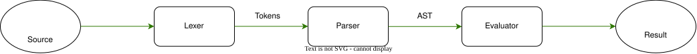

## Architecture

 
 
 
## illustrate
### Source : 
#### 

### Lexer : 
#### 

### Parser : 
#### 

### Eval :
#### 

### Result :
#### 
 
 
 

## Lexer & Pratt Parser Frontend Performance
Experimental computer :
####    OS: Ubuntu 24.04.4 LTS (Noble Numbat) x86_64
####    CPU: AMD Ryzen 5 2600 (12) @ 3.40 GHz
####    Memory: 4.05 GiB / 15.56 GiB

     
Empirical micro-benchmarks executed via `Criterion` (100 statistical samples per expression). Measurements encapsulate the full execution pipeline—from raw string tokenization to AST node generation and operator precedence parsing:

| Benchmark Target | Latency |
| :--- | :--- |
| **`"a = 5"`** | **`318.97 ns`** | 
| **`"-1 + 1"`** | **`363.91 ns`** | 
| **` "-(a + 5) -5"`** | **`716.90 ns`** |

---
